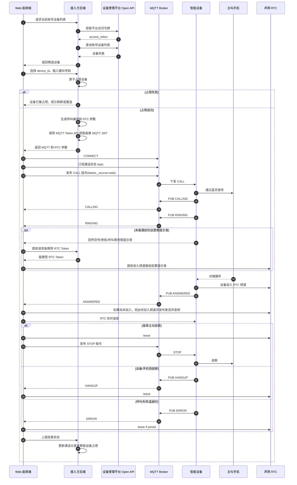

# 一通呼出的完整链路

这一章从座席点击呼叫开始，把完整链路串起来。后续章节会展开每一步的接口、topic 和消息结构。

## 完整序列图

## 呼叫前

1. 接入方后端调用设备管理平台 Open API，按账号手机号查询设备列表。
2. Web 前端展示候选设备。
3. 座席选择一台设备，输入或选择被叫号码。
4. 接入方后端占用这台设备。占用失败时，提示座席刷新设备列表或换一台设备。

设备列表只代表查询时刻的候选状态，不等于设备已经被当前座席独占。占用设备是正式呼叫前的必要步骤。

## 建立信令和音频准备

占用设备成功后，后端继续准备呼叫所需凭证：

1. 为 Web 座席申请 MQTT Token。
2. 为智能设备生成加入 RTC 频道所需的 RTC Token。
3. 向前端返回 App ID、MQTT WebSocket 地址、设备 ID、RTC channel、设备侧 RTC Token 等参数。
4. Web 前端建立 MQTT 连接。
5. Web 前端订阅设备通话状态 topic。

Web 端不需要订阅 MQTT presence。通话中设备离线或音频异常，应通过呼叫状态、RTC 远端用户事件、超时策略和业务后端清理来兜底。MQTT 连接参数和 topic 详见 [MQTT 协议](../reference/mqtt-topics.md)，MQTT JWT 获取详见 [MQTT JWT Token](../reference/tokens-mqtt.md)。

## 下发呼叫

Web 前端向设备的 `call` topic 发布 CALL 指令。设备收到后开始拨号，并按状态向 `evt/call` topic 上报：

- `CALLING`：设备开始拨号。
- `RINGING`：对端振铃，或者仍处于未接通前的运营商提示阶段。
- `ANSWERED`：对端接听。
- `HANGUP`：通话结束。
- `ERROR`：呼叫失败。

如果 CALL 中的 `labels._source=web`，未接通前的运营商语音提示也会回传给 Web 座席端，因此座席侧 RTC 不能再固定等到 `ANSWERED` 后才加入。推荐在拨号开始后尽早加入同一个声网 RTC 频道，以便销售在空号、停机、呼叫等待等场景下直接听到提示音并对号码做标注。

## 通话结束

通话可能由座席、设备、手机侧、网络异常或超时结束。无论哪种路径，接入方都应该完成同一组清理动作：

- 离开 RTC 频道。
- 停止或断开 MQTT 会话，或至少清理当前会话状态。
- 更新业务通话记录。
- 释放设备占用。
- 把 UI 恢复到可发起下一通电话的状态。

下一步建议阅读：[获取可呼叫设备](./03-device-list.md)、[占用设备](./04-device-reservation.md)、[发起呼叫](./06-start-call.md)。
