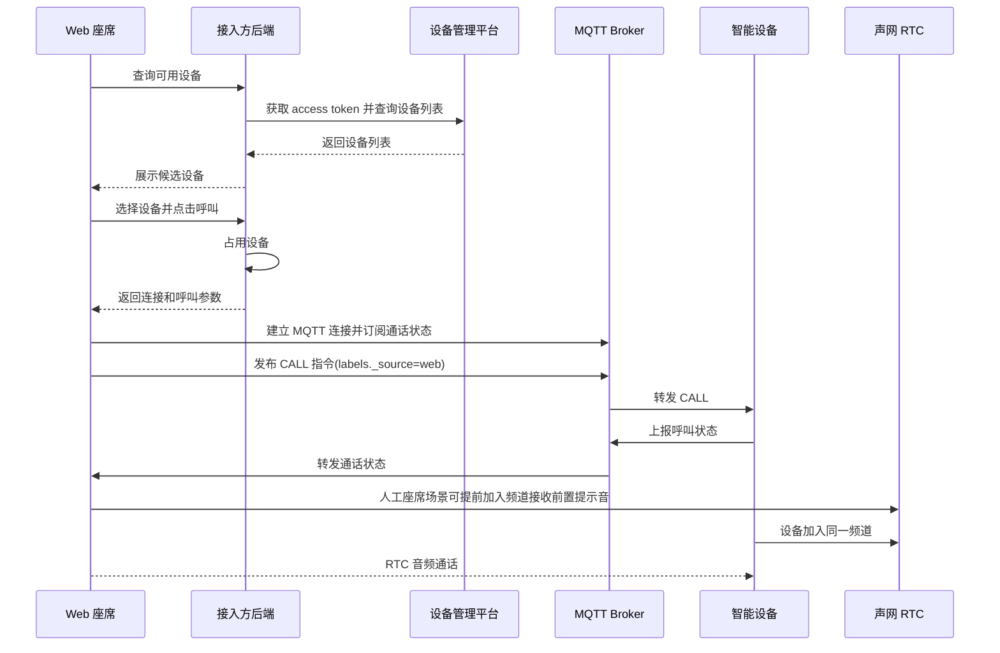

# 智能设备人工座席集成指南

这份文档面向正在集成智能设备人工呼出的开发者。它不按功能清单介绍产品，而是按一通 Web 人工座席呼出电话的真实路径展开：先拿到设备，再占用设备，然后通过 MQTT 下发呼叫，通过声网 RTC 建立座席和设备之间的实时音频，最后处理挂断、异常和真设备联调。

本版只覆盖 **Web 人工座席呼出**。呼入和 AI 外呼已经预留结构，但不在本版展开。

## 你要集成的是什么

Web 座席不直接操作主叫手机，也不直接拨 PSTN 电话。座席系统先从设备管理平台查询当前账号下的智能设备，选择一台可用设备后，由设备通过已连接手机的蓝牙链路拨出电话。Web 座席和设备之间的语音通过声网 RTC 传输，呼叫指令和通话状态通过 MQTT 传递。

## 推荐阅读路径

- 第一次接入：从 [理解产品如何工作](./guide/01-understand-smart-device.md) 开始。
- 正在写设备选择逻辑：看 [获取可呼叫设备](./guide/03-device-list.md) 和 [占用设备](./guide/04-device-reservation.md)。
- 正在写呼叫逻辑：看 [建立 MQTT 信令连接](./guide/05-mqtt-signaling.md)、[发起呼叫](./guide/06-start-call.md)、[处理通话状态](./guide/07-call-states.md)。
- 正在接音频：看 [接入声网 RTC 音频](./guide/08-rtc-audio.md)。
- 正在拿设备联调：看 [真设备联调](./guide/10-device-test.md)。
- 正在排查问题：看 [常见问题排查](./guide/11-troubleshooting.md)。

## 生产集成前提

生产环境必须有接入方后端。后端至少负责：

- 调用设备管理平台 Open API。
- 保存设备占用状态，避免多个座席同时使用同一台设备。
- 代理 MQTT Token 获取，避免把服务端凭证暴露给前端。
- 生成声网 RTC Token。
- 维护业务通话记录和异常清理。

Demo 可以帮助理解流程，但不要把 demo 中的密钥、Token 生成、设备占用逻辑直接搬到前端生产环境。

## 常用参考资料

- [Open API](./reference/open-api.md)：设备管理平台 URL、access token、设备列表接口。
- [MQTT 协议](./reference/mqtt-topics.md)：连接参数、topic、发布/订阅关系、QoS 和消息方向。
- [Tokens](./reference/tokens.md)：设备管理平台 access token、MQTT JWT Token、声网 RTC Token。
- [消息结构](./reference/message-schema.md)：CALL、STOP、CALL_STATE、DEVICE_EVENT 的完整结构。
